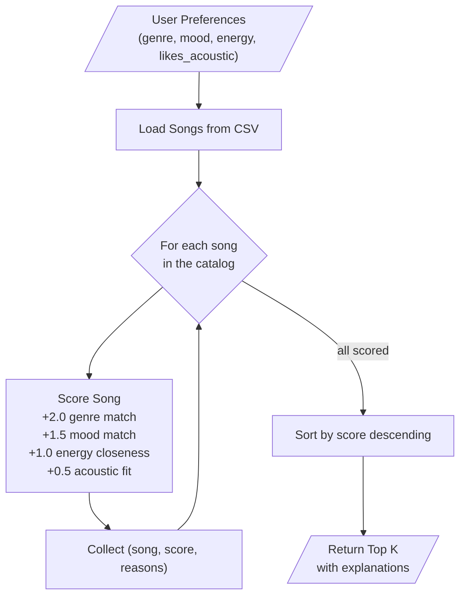

# 🎵 Music Recommender Simulation

## Project Summary

In this project you will build and explain a small music recommender system.

Your goal is to:

- Represent songs and a user "taste profile" as data
- Design a scoring rule that turns that data into recommendations
- Evaluate what your system gets right and wrong
- Reflect on how this mirrors real world AI recommenders

This project is a content-based music recommender that matches songs to a listener's taste profile. Given a user's preferred genre, mood, energy level, and acoustic preference, the system scores every song in a small CSV catalog and returns the top recommendations with explanations of why each song was chosen.

---

## How The System Works

### How Real-World Recommendations Work

Real music platforms like Spotify combine multiple approaches: collaborative filtering ("users like you also liked..."), content-based filtering (comparing audio features of songs), and deep learning on raw audio signals. They process millions of tracks and billions of listening events in real time. Our version focuses on the content-based approach at a small scale — comparing song attributes directly to user preferences using a transparent, rule-based scoring system.

### Our Design

**Song features used:** Each song has categorical attributes (`genre`, `mood`) and numerical attributes (`energy`, `tempo_bpm`, `valence`, `danceability`, `acousticness`) on a 0.0–1.0 scale.

**UserProfile stores:** A user's `favorite_genre`, `favorite_mood`, `target_energy` (0.0–1.0), and `likes_acoustic` (true/false).

**Scoring Rule (per song):** The recommender scores each individual song against the user profile:
- **Genre match:** +2.0 points if the song's genre matches the user's favorite (strongest signal)
- **Mood match:** +1.5 points if the mood matches
- **Energy closeness:** Up to +1.0 points, calculated as `1.0 - |target_energy - song_energy|` (rewards songs *closer* to the user's preferred energy, not simply higher or lower)
- **Acoustic fit:** Up to +0.5 points based on the user's acoustic preference

Maximum possible score: 5.0

**Ranking Rule (across all songs):** The system loops through every song in the catalog, computes its score, sorts all songs from highest to lowest score, and returns the top K results along with an explanation of which rules contributed to each song's score.

### Data Flow



### Dataset

The song catalog (`data/songs.csv`) contains 18 songs across 12 genres: pop, lofi, rock, ambient, jazz, synthwave, indie pop, r&b, electronic, classical, country, metal, reggae, hip-hop, and folk. Moods include happy, chill, intense, relaxed, moody, and focused. The original 10 starter songs were expanded with 8 additional songs to ensure genre and mood diversity.

### User Profile

The `UserProfile` is a dictionary with four keys:

```python
user_prefs = {
    "genre": "pop",         # favorite genre (exact match against song genre)
    "mood": "happy",        # favorite mood (exact match against song mood)
    "energy": 0.8,          # target energy level, 0.0-1.0
    "likes_acoustic": False  # preference for acoustic vs. electronic sound
}
```

This profile can differentiate between very different listeners (e.g., "intense rock" vs. "chill lofi") because all four fields diverge between those profiles. The limitation is that it only captures one genre and one mood — real users have multi-dimensional taste.

### Algorithm Recipe (Finalized Weights)

| Rule | Points | Calculation |
|---|---|---|
| Genre match | +2.0 | Exact match = 2.0, else 0.0 |
| Mood match | +1.5 | Exact match = 1.5, else 0.0 |
| Energy closeness | up to +1.0 | `1.0 - abs(user_energy - song_energy)` |
| Acoustic fit | up to +0.5 | `0.5 * acousticness` if likes_acoustic, else `0.5 * (1 - acousticness)` |
| **Max total** | **5.0** | |

### Expected Biases

- **Genre bubble:** Genre is worth 40% of the max score (2.0/5.0), so the system will strongly favor same-genre songs even if another genre has a better mood/energy fit.
- **Small catalog bias:** With only 18 songs and 12 genres, most genres have just 1 song — the system can't differentiate *within* a genre for rare genres.
- **Single-mood limitation:** Users who enjoy different moods in different contexts (studying vs. gym) cannot be represented by a single profile.

---

## Getting Started

### Setup

1. Create a virtual environment (optional but recommended):

   ```bash
   python -m venv .venv
   source .venv/bin/activate      # Mac or Linux
   .venv\Scripts\activate         # Windows

2. Install dependencies

```bash
pip install -r requirements.txt
```

3. Run the app:

```bash
python -m src.main
```

### Running Tests

Run the starter tests with:

```bash
pytest
```

You can add more tests in `tests/test_recommender.py`.

---

## Experiments You Tried

### Weight Shift Experiment: Genre Halved, Energy Doubled

Changed genre weight from 3.0 to 1.5 and energy weight from 2.0 to 4.0. Key result: for the "Deep Intense Rock" profile, Gym Hero (pop, energy 0.93) overtook Storm Runner (rock, energy 0.91) as the #1 recommendation. A 0.02 energy difference was amplified by the 4x multiplier and outweighed the halved genre bonus. This showed the system is highly sensitive to weight tuning and that genre weight is important for keeping recommendations genre-relevant. The original weights were restored.

### Multi-Profile Testing

Tested 6 profiles including 3 adversarial edge cases:

- **Conflicting preferences** (R&B + relaxed + energy 0.95): The system averaged out the contradiction, producing scattered results that did not fully satisfy either the mood or energy preference.
- **Genre not in catalog** (k-pop): Graceful degradation — mood and energy still produced a reasonable ranking despite zero genre matches being possible.
- **Zero energy** (classical + relaxed + energy 0.0): Correctly surfaced the quietest, most acoustic songs in the catalog.

### Terminal Output — Original Weights

```
Loaded songs: 18

=======================================================
  [High-Energy Pop]
  Prefs: genre=pop | mood=happy | energy=0.8
=======================================================

  #1  Sunrise City by Neon Echo
      Genre: pop | Mood: happy | Energy: 0.82
      Score: 8.46
      Reasons: genre match (+3.0); mood match (+2.0); energy similarity (+1.96); high danceability (+1.0); positive valence (+0.5)

  #2  Gym Hero by Max Pulse
      Genre: pop | Mood: intense | Energy: 0.93
      Score: 6.24
      Reasons: genre match (+3.0); energy similarity (+1.74); high danceability (+1.0); positive valence (+0.5)

  #3  Rooftop Lights by Indigo Parade
      Genre: indie pop | Mood: happy | Energy: 0.76
      Score: 5.42

  #4  Dust Road Anthem by The Porchmen
      Genre: country | Mood: happy | Energy: 0.65
      Score: 5.20

  #5  Night Drive Loop by Neon Echo
      Genre: synthwave | Mood: moody | Energy: 0.75
      Score: 2.90

-------------------------------------------------------

=======================================================
  [Chill Lofi]
  Prefs: genre=lofi | mood=chill | energy=0.4
=======================================================

  #1  Midnight Coding by LoRoom          Score: 6.96
  #2  Library Rain by Paper Lanterns      Score: 6.90
  #3  Island Breeze by Sun Tide           Score: 5.30
  #4  Focus Flow by LoRoom               Score: 5.00
  #5  Spacewalk Thoughts by Orbit Bloom   Score: 3.76

-------------------------------------------------------

=======================================================
  [Deep Intense Rock]
  Prefs: genre=rock | mood=intense | energy=0.95
=======================================================

  #1  Storm Runner by Voltline            Score: 6.92
  #2  Gym Hero by Max Pulse               Score: 5.46
  #3  Bass Drop Central by DJ Frostbyte   Score: 5.00
  #4  Concrete Jungle by MC Axiom         Score: 4.80
  #5  Rage Circuit by Iron Veil           Score: 3.94

-------------------------------------------------------

=======================================================
  [Conflicting: High Energy + Sad Mood]
  Prefs: genre=r&b | mood=relaxed | energy=0.95
=======================================================

  #1  Late Night Bars by Dre Velvet       Score: 5.20
  #2  Gym Hero by Max Pulse               Score: 3.46
  #3  Coffee Shop Stories by Slow Stereo  Score: 3.34
  #4  Sunrise City by Neon Echo           Score: 3.24
  #5  Mountain Morning by Fern & Ivy      Score: 3.20

-------------------------------------------------------

=======================================================
  [Genre Not In Catalog]
  Prefs: genre=k-pop | mood=happy | energy=0.7
=======================================================

  #1  Dust Road Anthem by The Porchmen    Score: 5.40
  #2  Rooftop Lights by Indigo Parade     Score: 5.38
  #3  Sunrise City by Neon Echo           Score: 5.26
  #4  Island Breeze by Sun Tide           Score: 3.10
  #5  Gym Hero by Max Pulse               Score: 3.04

-------------------------------------------------------

=======================================================
  [Zero Energy Listener]
  Prefs: genre=classical | mood=relaxed | energy=0.0
=======================================================

  #1  Quiet Strings by Clara Muse         Score: 7.10
  #2  Mountain Morning by Fern & Ivy      Score: 3.90
  #3  Coffee Shop Stories by Slow Stereo  Score: 3.76
  #4  Island Breeze by Sun Tide           Score: 2.50
  #5  Dust Road Anthem by The Porchmen    Score: 2.20

-------------------------------------------------------
```

---

## Limitations and Risks

- **Tiny catalog (18 songs):** Most genres have only 1 song, so the system cannot differentiate within a genre. A rock fan always gets Storm Runner regardless of subgenre preference.
- **Genre dominance:** Genre match is worth 3.0 out of a max 8.5 points. A same-genre song with wrong mood and energy can outscore a perfect mood+energy match from another genre.
- **Built-in danceability/valence bias:** Songs with high danceability (>=0.7) and high valence (>=0.7) get bonus points regardless of user preference. This quietly favors upbeat, danceable music for all users, including those who prefer slow or melancholic tracks.
- **No lyrics, language, or cultural context:** The system cannot distinguish between English and non-English music, does not consider lyrical themes, and ignores cultural context entirely.
- **Single-profile limitation:** Users can only express one genre and one mood. Real listeners have contextual taste (gym vs. study vs. commute).

See [model_card.md](model_card.md) for a deeper analysis.

---

## Reflection

Read and complete `model_card.md`:

[**Model Card**](model_card.md)

See also: [**reflection.md**](reflection.md) for detailed profile-pair comparisons.

Building this recommender taught me that the "algorithm" is really just a set of human decisions encoded as weights. When I chose genre=3.0 and mood=2.0, I was implicitly saying "genre matters 50% more than mood" — and that single decision determined whether a pop fan sees rock songs or not. The experiment of doubling energy weight showed how fragile these choices are: a small weight change flipped the #1 result from the "right" genre to a completely different one. Real platforms like Spotify face this same tradeoff at massive scale, but with the added complexity of learning weights from user behavior rather than setting them by hand.

The most eye-opening finding was how "Gym Hero" appeared in 4 out of 6 top-5 lists. Its high danceability and valence scores gave it a persistent advantage across almost every profile, even when the user did not ask for danceable or upbeat music. This is exactly how filter bubbles form in real systems — certain items with "universally appealing" features get recommended to everyone, crowding out niche content that might be a better fit for specific users. Fairness in recommendation is not just about the algorithm being correct; it is about whose taste the default bonuses are designed around

