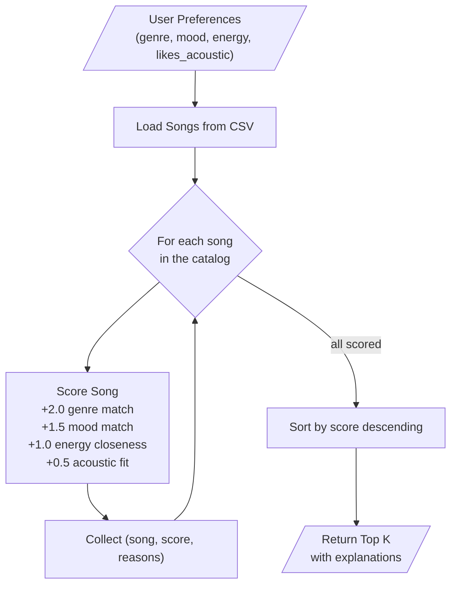

# 🎵 Music Recommender Simulation

## Project Summary

In this project you will build and explain a small music recommender system.

Your goal is to:

- Represent songs and a user "taste profile" as data
- Design a scoring rule that turns that data into recommendations
- Evaluate what your system gets right and wrong
- Reflect on how this mirrors real world AI recommenders

This project is a content-based music recommender that matches songs to a listener's taste profile. Given a user's preferred genre, mood, energy level, and acoustic preference, the system scores every song in a small CSV catalog and returns the top recommendations with explanations of why each song was chosen.

---

## How The System Works

### How Real-World Recommendations Work

Real music platforms like Spotify combine multiple approaches: collaborative filtering ("users like you also liked..."), content-based filtering (comparing audio features of songs), and deep learning on raw audio signals. They process millions of tracks and billions of listening events in real time. Our version focuses on the content-based approach at a small scale — comparing song attributes directly to user preferences using a transparent, rule-based scoring system.

### Our Design

**Song features used:** Each song has categorical attributes (`genre`, `mood`) and numerical attributes (`energy`, `tempo_bpm`, `valence`, `danceability`, `acousticness`) on a 0.0–1.0 scale.

**UserProfile stores:** A user's `favorite_genre`, `favorite_mood`, `target_energy` (0.0–1.0), and `likes_acoustic` (true/false).

**Scoring Rule (per song):** The recommender scores each individual song against the user profile:
- **Genre match:** +2.0 points if the song's genre matches the user's favorite (strongest signal)
- **Mood match:** +1.5 points if the mood matches
- **Energy closeness:** Up to +1.0 points, calculated as `1.0 - |target_energy - song_energy|` (rewards songs *closer* to the user's preferred energy, not simply higher or lower)
- **Acoustic fit:** Up to +0.5 points based on the user's acoustic preference

Maximum possible score: 5.0

**Ranking Rule (across all songs):** The system loops through every song in the catalog, computes its score, sorts all songs from highest to lowest score, and returns the top K results along with an explanation of which rules contributed to each song's score.

### Data Flow



### Dataset

The song catalog (`data/songs.csv`) contains 18 songs across 12 genres: pop, lofi, rock, ambient, jazz, synthwave, indie pop, r&b, electronic, classical, country, metal, reggae, hip-hop, and folk. Moods include happy, chill, intense, relaxed, moody, and focused. The original 10 starter songs were expanded with 8 additional songs to ensure genre and mood diversity.

### User Profile

The `UserProfile` is a dictionary with four keys:

```python
user_prefs = {
    "genre": "pop",         # favorite genre (exact match against song genre)
    "mood": "happy",        # favorite mood (exact match against song mood)
    "energy": 0.8,          # target energy level, 0.0-1.0
    "likes_acoustic": False  # preference for acoustic vs. electronic sound
}
```

This profile can differentiate between very different listeners (e.g., "intense rock" vs. "chill lofi") because all four fields diverge between those profiles. The limitation is that it only captures one genre and one mood — real users have multi-dimensional taste.

### Algorithm Recipe (Finalized Weights)

| Rule | Points | Calculation |
|---|---|---|
| Genre match | +2.0 | Exact match = 2.0, else 0.0 |
| Mood match | +1.5 | Exact match = 1.5, else 0.0 |
| Energy closeness | up to +1.0 | `1.0 - abs(user_energy - song_energy)` |
| Acoustic fit | up to +0.5 | `0.5 * acousticness` if likes_acoustic, else `0.5 * (1 - acousticness)` |
| **Max total** | **5.0** | |

### Expected Biases

- **Genre bubble:** Genre is worth 40% of the max score (2.0/5.0), so the system will strongly favor same-genre songs even if another genre has a better mood/energy fit.
- **Small catalog bias:** With only 18 songs and 12 genres, most genres have just 1 song — the system can't differentiate *within* a genre for rare genres.
- **Single-mood limitation:** Users who enjoy different moods in different contexts (studying vs. gym) cannot be represented by a single profile.

---

## Getting Started

### Setup

1. Create a virtual environment (optional but recommended):

   ```bash
   python -m venv .venv
   source .venv/bin/activate      # Mac or Linux
   .venv\Scripts\activate         # Windows

2. Install dependencies

```bash
pip install -r requirements.txt
```

3. Run the app:

```bash
python -m src.main
```

### Running Tests

Run the starter tests with:

```bash
pytest
```

You can add more tests in `tests/test_recommender.py`.

---

## Experiments You Tried

Use this section to document the experiments you ran. For example:

- What happened when you changed the weight on genre from 2.0 to 0.5
- What happened when you added tempo or valence to the score
- How did your system behave for different types of users

---

## Limitations and Risks

Summarize some limitations of your recommender.

Examples:

- It only works on a tiny catalog
- It does not understand lyrics or language
- It might over favor one genre or mood

You will go deeper on this in your model card.

---

## Reflection

Read and complete `model_card.md`:

[**Model Card**](model_card.md)

Write 1 to 2 paragraphs here about what you learned:

- about how recommenders turn data into predictions
- about where bias or unfairness could show up in systems like this


---

## 7. `model_card_template.md`

Combines reflection and model card framing from the Module 3 guidance. :contentReference[oaicite:2]{index=2}  

```markdown
# 🎧 Model Card - Music Recommender Simulation

## 1. Model Name

Give your recommender a name, for example:

> VibeFinder 1.0

---

## 2. Intended Use

- What is this system trying to do
- Who is it for

Example:

> This model suggests 3 to 5 songs from a small catalog based on a user's preferred genre, mood, and energy level. It is for classroom exploration only, not for real users.

---

## 3. How It Works (Short Explanation)

Describe your scoring logic in plain language.

- What features of each song does it consider
- What information about the user does it use
- How does it turn those into a number

Try to avoid code in this section, treat it like an explanation to a non programmer.

---

## 4. Data

Describe your dataset.

- How many songs are in `data/songs.csv`
- Did you add or remove any songs
- What kinds of genres or moods are represented
- Whose taste does this data mostly reflect

---

## 5. Strengths

Where does your recommender work well

You can think about:
- Situations where the top results "felt right"
- Particular user profiles it served well
- Simplicity or transparency benefits

---

## 6. Limitations and Bias

Where does your recommender struggle

Some prompts:
- Does it ignore some genres or moods
- Does it treat all users as if they have the same taste shape
- Is it biased toward high energy or one genre by default
- How could this be unfair if used in a real product

---

## 7. Evaluation

How did you check your system

Examples:
- You tried multiple user profiles and wrote down whether the results matched your expectations
- You compared your simulation to what a real app like Spotify or YouTube tends to recommend
- You wrote tests for your scoring logic

You do not need a numeric metric, but if you used one, explain what it measures.

---

## 8. Future Work

If you had more time, how would you improve this recommender

Examples:

- Add support for multiple users and "group vibe" recommendations
- Balance diversity of songs instead of always picking the closest match
- Use more features, like tempo ranges or lyric themes

---

## 9. Personal Reflection

A few sentences about what you learned:

- What surprised you about how your system behaved
- How did building this change how you think about real music recommenders
- Where do you think human judgment still matters, even if the model seems "smart"

